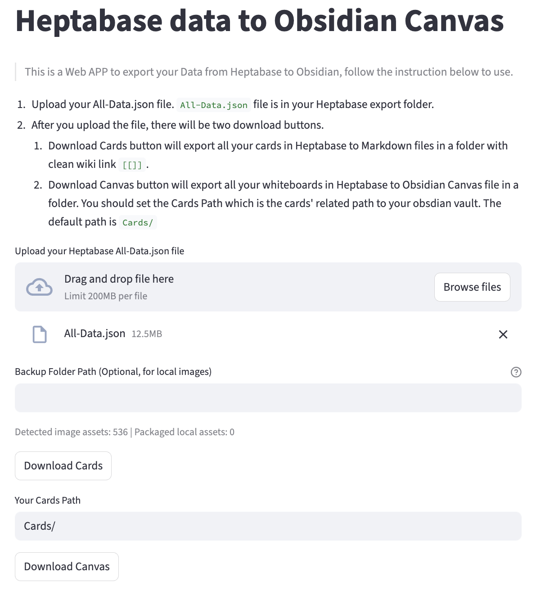

# Heptabase Export to Obsidian

這是一個網頁工具，幫你把 **Heptabase** 的筆記資料轉成可以直接在 **Obsidian** 使用的格式。

> **不會寫程式也能用。** 你只需要從 Heptabase 匯出一個 JSON 檔，上傳到這個工具，就能下載整理好的 Obsidian 筆記。




---

## 這工具做什麼？

Heptabase 允許你匯出一個叫 `All-Data.json` 的檔案，裡面包含你所有的卡片和白板。但這個格式 Obsidian 沒辦法直接讀取。

這個工具會幫你轉換成：

- **卡片 → Markdown 檔案（`.md`）**：每張 Heptabase 卡片變成一個 Obsidian 筆記
- **白板 → Obsidian Canvas（`.canvas`）**：每個 Heptabase 白板變成一個 Obsidian 視覺化畫布

---

## 使用步驟

### 第一步：從 Heptabase 匯出資料

1. 打開 Heptabase
2. 進入設定 → 匯出（Export）
3. 選擇匯出所有資料，下載 `All-Data.json`

### 第二步：啟動工具

**方法 A：本機執行（需要 Python）**

1. 安裝 Poetry（若尚未安裝）

```bash
pipx install poetry
```

2. 在專案根目錄初始化

```bash
cd /path/to/Heptabase-Export
poetry init -n
```

3. 加入依賴並安裝

```bash
poetry add streamlit
poetry install
```

4. 啟動

```bash
poetry run streamlit run app.py
```

啟動後，瀏覽器會自動開啟工具頁面。

**方法 B：若有部署版本**

直接用瀏覽器開啟即可，不需要安裝任何東西。

### 第三步：轉換並下載

1. 上傳剛才匯出的 `All-Data.json`
2. （建議）若要保留本地圖片，填入 `Backup Folder Path (Optional, for local images)`  
   例如：`/Users/bonnie/Documents/bonnie/heptabase/Heptabase-Data-Backup-...`
3. 點「下載 Cards.zip」，取得所有卡片的 Markdown 檔案與 `assets/` 圖片資料夾
4. （選用）如果你的卡片資料夾名稱不是 `Cards/`，在「Your Cards Path」欄位修改
5. 點「下載 Canvas.zip」，取得所有白板的 Canvas 檔案

### 第四步：匯入 Obsidian

1. 解壓 `Cards.zip` 到你的 Obsidian vault（建議放在 `Cards/` 資料夾）
2. 解壓 `Canvas.zip` 到同一個 vault 內
3. 打開 Obsidian，就能看到你的筆記和白板了

> **注意**：Cards 和 Canvas 要在同一個 vault 裡，白板才能正確連結到筆記。

---

## 環境需求

- Python 3.9 以上
- [Poetry](https://python-poetry.org/)（套件管理工具）

---

## 輸出格式說明

### 卡片檔名

```
{卡片標題}.md
```

例如：`我的讀書心得.md`

若有同名卡片，會自動產生 `我的讀書心得 (2).md`、`我的讀書心得 (3).md` 這類去重檔名。

### 卡片 Frontmatter（筆記的隱藏資訊區）

每個 Markdown 檔案開頭都會有這段：

```yaml
---
heptabase_id: "a1b2c3d4-xxxx"
heptabase_title: "Heptabase 原始標題"
heptabase_display_title: "我的讀書心得"
---
```

這讓你未來還能對照回 Heptabase 的原始 ID。

### 卡片之間的連結

Heptabase 裡卡片連結的格式 `{{card uuid}}` 會自動轉換為 Obsidian 的 `[[檔名|標題]]` 格式，在 Obsidian 裡點擊就能跳轉。

### 圖片輸出規則

- 若圖片可對應到本地資產檔（或 JSON 內嵌內容），會輸出為 Obsidian 嵌入格式：  
  `![[assets/檔名.png]]`
- 若只有外部網址，會保留標準 Markdown：  
  ``
- `Cards.zip` 內會包含 `assets/` 目錄（有可打包的圖片時）

### 白板（Canvas）

- 白板檔名：`{白板名稱}.canvas`（重名時會加 `(2)`, `(3)`）
- 白板裡的每個卡片節點會正確對應到轉換後的 `.md` 檔案
- 卡片之間的連線也會保留

---

## 已知行為

- 已移到垃圾桶（`isTrashed`）的卡片不會匯出
- 沒有標題的卡片，檔名會是 `Untitled.md`（重名時會加序號）
- Rich text（Heptabase 的格式化文字）轉 Markdown 為盡力轉換，極少數複雜格式可能會退化為純文字
- 若你只提供 `All-Data.json`，但資料中的圖片節點只有 `fileId` 沒有 URL/base64，圖片可能無法顯示。請填入 `Backup Folder Path` 讓工具從 `*-assets` 目錄補齊圖片
- 若不同圖片在備份資料夾內檔名重複，可能出現少數圖片對應錯位（目前採檔名比對）

---

## 圖片故障排查

1. 匯出後確認 `Cards` 目錄下有 `assets/`
2. 打開任一含圖卡片，確認語法是 `![[assets/...]]` 或 ``
3. 本地圖請確認 `assets` 與卡片 `.md` 在同一層目錄
4. 重新匯出前可先刪除舊的 `Cards` 目錄，避免混到舊檔

---

## 授權

詳見 [LICENSE](./LICENSE)。
